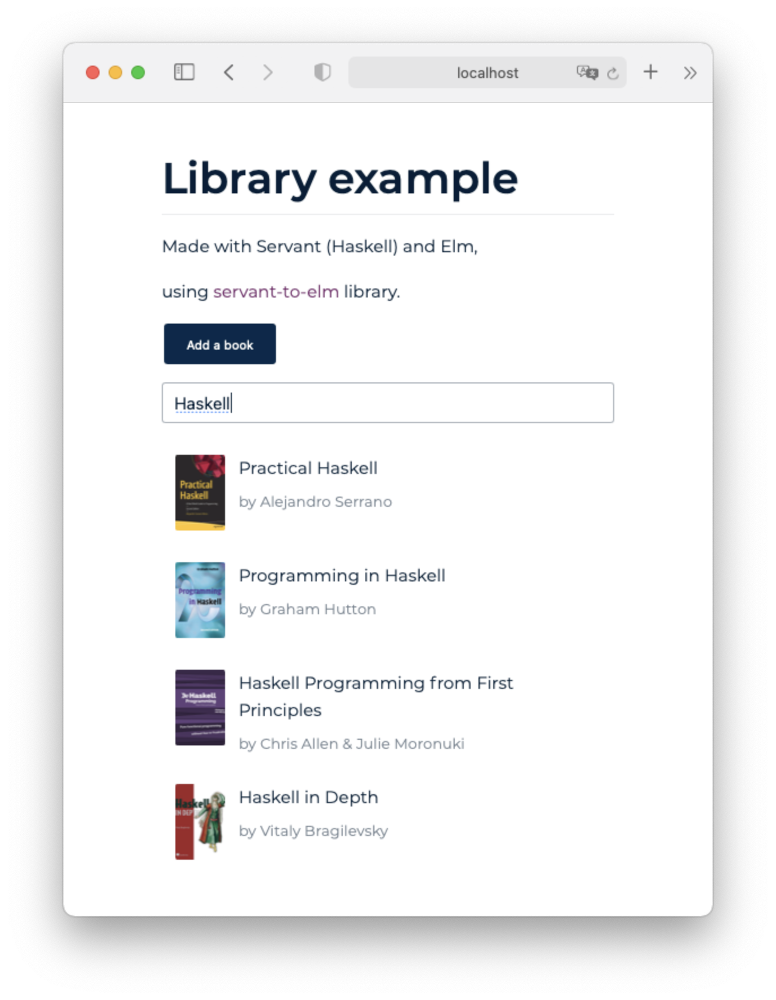

# servant-to-elm-example



This example is a full-stack web application, built in a typesafe functional way.

What's cool here is that [servant-to-elm] does the job of generating types and decoders/encoders from Haskell types and [Servant] definition to Elm, which not only catches regressions in the compile-time but also provides ready (and highly configurable) Elm functions to fetch necessary data from the server.

## Prepare

- Install [Stack] and [Elm]
- Run code generation
  ```sh
  cd backend && stack run codegen
  ```
- Install frontend dependencies (it's only `elm-live`)
  ```sh
  cd frontend && npm i
  ```

### Set up editor (optional)

- If you are using VSCode and you want to open both frontend and backend as a single workspace, use `File > Open Workspace` and choose `servant-to-elm-example.code-workspace`. In this scenario, VSCode will work correctly with both languages simultaneously. Also, the editor may recommend extensions, and installing them is a wise choice.

## Run

- Start the server on port 8000:
  ```sh
  cd backend && stack run server
  ```
- Run frontend in dev mode
  ```sh
  cd frontend && npm start
  ```
- Open http://localhost:8080

## Domain model: Library

- A book can have exactly 1 author
- An author can have zero to many books
- Book title must be unique per author
- The author's name must be unique

## This example does demonstrate:

- [x] How to fetch data and handle errors and "loading" state
- [x] How to post a new entity related to another, either new or existing one (submit a book with a new or existing author)

## This example does not demonstrate:

- User input ~~validation~~ parsing best practices
- Client-side routing best practices
- Debouncing user input
- Client-side validation before submitting a form
- Subscriptions via WebSockets (which could be implemented, but they are related more to Servant or Elm, rather than to code-generation)

### Other choices

- New entries that are in relation are submitted together and inserted transactionally.
- Search is case-insensitive

## Technical notes

- This app was not tested on Windows systems yet. While is not a showcase of cross-platform compatibility, you can still open an issue or PR if something does not work as expected.

### Adding new types

- in `backend/src/DomainModel.hs`:
  - Define the type
  - Derive necessary instances, also specify Elm module name and Elm type (it's better to keep type name the same, but it's convenient to use one module for several coupled types - see `Book`, `NewBook`, and `NewBookAuthor` types and corresponding generated Elm module)
  - Add the type to `typeDefinitions` list - `jsonDefinitions @YourNewType`
- Use your type in `backend/src/Server.hs` or wherever it's intended to
- Run code-generation again

### Design choices and alternatives

- An obsolete generated Elm code can be removed before writing the new ones. Subdirectories that must be deleted are listed in `backend/src/Codegen.hs`. In this example, only the `frontend/src/Api` directory is removed before writing new files.
- One of the alternatives to this approach is GraphQL, and there is a [Haskell/Elm full-stack GraphQL example app](https://github.com/higherkindness/mu-graphql-example-elm). This example app was shamelessly inspired by that example.

[stack]: https://docs.haskellstack.org/en/stable/README/#how-to-install
[elm]: https://guide.elm-lang.org/install/elm.html
[servant]: https://www.servant.dev/
[servant-to-elm]: https://github.com/folq/servant-to-elm
